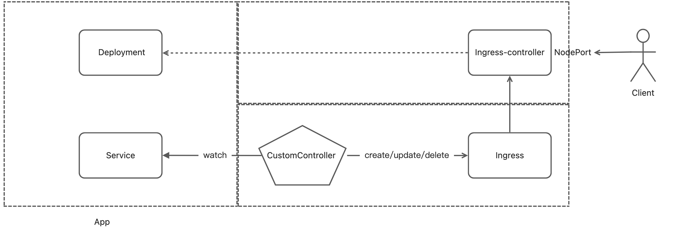

# 自定义控制器

需求：运维团队系统管控部署在 k8s 集群里的对外暴露服务，开发团队无需关心服务是如何暴露给用户的



开发团队创建应用的 manifests，为 Service 资源添加 annotation 为 "ingress/http: true"来决定终端用户是否可以访问该服务，默认不能访问。至于具体如何让用户可以访问到服务，开发团队不需要关心；

Custom Controller 需要监听 Service 资源，当 Service 发生变化时：
- 如果新增 Service
  - 包含指定 annotation，创建 ingress 资源
  - 不包含指定 annotation，则忽略
- 如果删除 Service
  - 删除 ingress 资源对象
- 如果更新 Service
  - 包含指定 annotation，检查 ingress 资源对象是否存在，不存在创建，存在则忽略
  - 不包含指定 annotation，检查 ingress 资源对象是否存在，存在删除，不存在则忽略
 
Ingress Controller 根据 ingress 更新 nginx 配置，最后终端用户便可以通过 ingress controller 的地址访问到开发团队指定的服务

## 环境
- [ingress-nginx-controller](manifests/ingress-nginx-baremetal.yaml)
- [nginx-deployment-service](manifests/nginx-deployment-service.yaml)

## 编码 

## 部署
### 制作镜像
编写 [Dockerfile](Dockerfile) ，并构建镜像：
```shell
docker build -t ingress-manager:1.0.0 .
```

### 开始部署
```shell
# service account
kubectl create sa ingress-manager-sa --dry-run=client -o yaml > manifests/ingress-manager-sa.yaml

# role
kubectl create clusterrole ingress-manager-role --resource=ingress,service --verb list,watch,create,update,delete --dry-run=client -o yaml > manifests/ingress-manager-role.yaml

# rolebinding 
kubectl create clusterrolebinding ingress-manager-rb --role ingress-manager-role --serviceaccount default:ingress-manager-sa --dry-run=client -o yaml > manifests/ingress-manager-rolebinding.yaml

# deployment
kubectl create deployment ingress-manager --image ingress-manager:1.0.0 --dry-run=client -o yaml > manifests/ingress-manager.yaml
```


